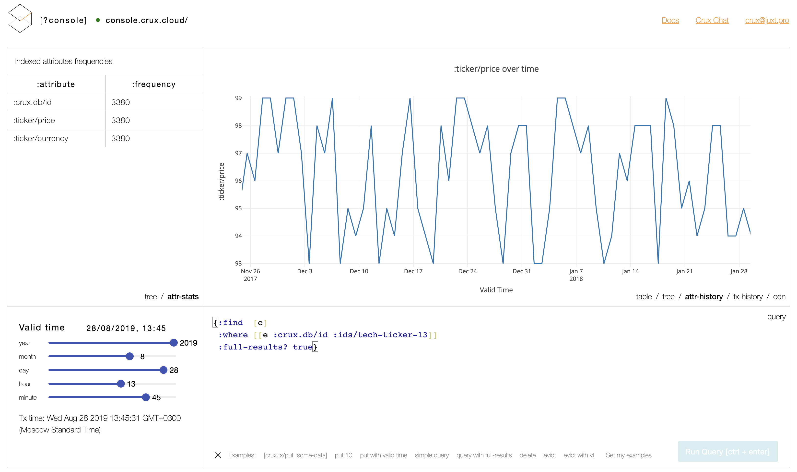

# Crux Console

Console is a webapp that gives allows you to query Crux and see data from different perpectives.


It can be used as a standalone analytics tool or as an educational tool.

## Educational use
Console comes with a set of example queries but you can make it load your own
set by providing a url param `examples-gist=gist-raw-url`, like
[console.crux.cloud/console?examples-gist=https://gist.githubusercontent.com/spacegangster/b68f72e3c81524a71af1f3033ea7507e/raw/5fb55fe8e766245a3338f6e5c508ffbbe824900f/examples.edn](http://console.crux.cloud/console?examples-gist=https://gist.githubusercontent.com/spacegangster/b68f72e3c81524a71af1f3033ea7507e/raw/5fb55fe8e766245a3338f6e5c508ffbbe824900f/examples.edn)
This way Console will import this file.
Important note : link must point to raw gist content.
Preset queries example:
```clojure
[{:title "Space Stocks"
  :query {:find [e]
          :where [[e :crux.db/id _]]}}
 {:title "Add space stocks"
  :query [[:crux.tx/put {:crux.db/id 33 :title "Company 3"}]]}]
```


## How to build or develop

### Prerequisites

All builds require `node` and `yarn` to be installed.

`yarn` is, at the moment, a much better alternative to npm.
Yarn ROI is that in 2-3 uses it will save more time than you spent
installing and learning it, compared to 2-3 runs of npm install.


### Release flow
1. `lein build` will produce you production ready assets
2. `lein build-ebs` does the build above and packs it into
    Elastic Beanstalk package which we upload to AWS to see console.crux.cloud


### Dev flow
To launch development REPL

#### Preferred
```sh
lein cljs-dev  # will install all the node modules, launch cljs compiling guard with code hotswapping
dev/run.sh     # will launch edge rebel repl
```


#### Alternative
```sh
# once
yarn install

dev/shadow-dev &
# will launch shadow-cljs watch build
# it runs a local version

dev/run.sh 
# will launch the server
```


## Sidenotes

#### Plotly
Note that Plotly has its own packaging model (due to heavy weight beneath),
so search for different packages on npm if you need more fine-grained control.
e.g.

- All-in-one https://www.npmjs.com/package/plotly.js-dist

## Potential extension points


### Build
Can be improved with skipping with uberjar build and just updating the jar with

```
jar uf jar-file input-file(s)
```
